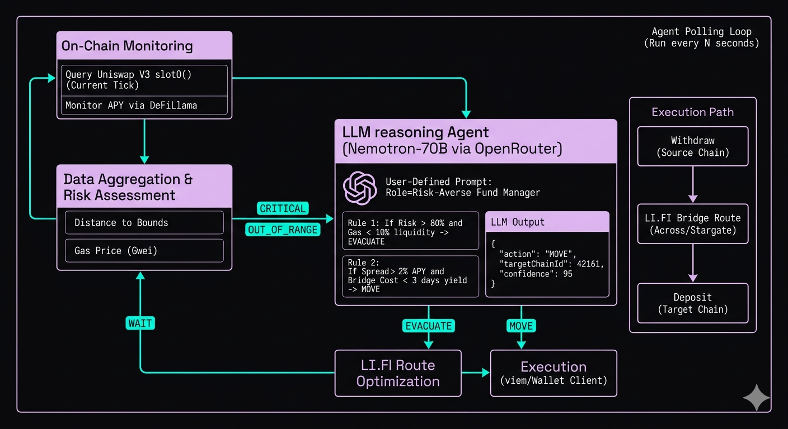

# BRAHMA

> **Brahma watches your USDC across chains 24/7, finds the best Aave V3 yield, and moves your funds there automatically using LI.FI bridges — no clicks required.**

An autonomous DeFi operations system built for the **LI.FI Vibeathon**. Two fully autonomous strategies from a single dashboard: a cross-chain USDC Yielder powered by Aave V3 + LI.FI, and an LP Guardian that watches Uniswap V3 positions and evacuates liquidity when risk thresholds are breached.

▶ [Video Explanation of Brahma](https://x.com/daiwik_mhi/status/2031030761244315967?s=20)

---

## Modes



---

### 🔁 Yielder

Brahma's primary mode. It runs a **fully autonomous capital allocation loop** — no human input required after the initial deposit. The agent holds USDC in whichever Aave V3 pool is currently earning the highest yield, and moves it the moment a meaningfully better opportunity appears elsewhere.

#### What Makes It Autonomous

| Property | Detail |
|---|---|
| **Self-locating** | Reads aToken balances live across all 4 chains every tick — always knows where funds actually are |
| **Fee-aware** | Fetches a real LI.FI bridge quote before deciding — won't move for 0.3% APY if the bridge fee eats the gain |
| **LLM-in-the-loop** | An LLM reasons MOVE / STAY / WITHDRAW with full yield table + bridge cost + current position as context |
| **Allocation cap** | Users set a USDC cap — agent only manages that slice, leaving the rest untouched |
| **Dual mode** | Simulation validates every step via `simulateContract` + `eth_call` without broadcasting |

#### The Cycle — Every 60 Seconds

```
1. Scan        →  DeFiLlama yields across 10 protocols, 4 chains (60s cache)
2. Locate      →  read aToken balances on-chain to find current position
3. Quote       →  fetch real LI.FI bridge cost for the potential move
4. Decide      →  LLM evaluates MOVE / STAY / WITHDRAW with full context
5. Gate        →  hard check: APY diff must exceed MIN_APY_DIFF (2%) + bridge cost
6. Execute     →  withdraw Aave → bridge via LI.FI → deposit Aave on target chain
7. Log         →  move recorded with chain, APY, tx hash, timestamp
```

> If no position is detected (first run or after a manual withdrawal), the agent deposits into the current best pool immediately — no move trigger required.

#### Protocols Scanned

| Protocol | Role |
|---|---|
| **Aave V3** | ✅ Actionable — agent deposits here |
| Compound V3 | Market context |
| Morpho Blue | Market context |
| Moonwell | Market context |
| Seamless | Market context |
| Fluid | Market context |
| Spark | Market context |
| Euler | Market context |
| Ionic | Market context |

Non-actionable protocols appear in the Yield Scanner table (dimmed) for market awareness. Only Aave V3 pools are passed to the LLM and acted on.

---

### 🛡 Guardian

A **reactive risk monitor** for Uniswap V3 concentrated liquidity positions. LP positions in tight ranges can go out-of-range quickly — when that happens, liquidity stops earning fees and sits idle while impermanent loss accumulates. The Guardian watches the pool tick in real time and evacuates before the position goes fully out-of-range.

#### How It Works

The agent computes a **risk score (0–1000)** based on how close the current tick is to the position's range boundary. At 0 the position is centered; at 1000 the tick is exactly at the edge.

```
riskScore = (1 - tickDelta / totalRange) × 1000
```

When risk crosses the configured threshold *(default 500 — halfway to the boundary)*, the LLM is called with the current tick, range, risk score, and recent history. It returns one of:

| Decision | Action |
|---|---|
| **EVACUATE** | Remove 100% of liquidity, bridge to safety chain via LI.FI |
| **PARTIAL** | Remove 50%, keep the position partially open |
| **WAIT** | Log and continue monitoring |

> **Why LLM over a simple threshold?** A tick briefly touching a boundary during volatility is different from a sustained drift. The LLM factors in the rate of change across recent readings and decides whether the move is structural or momentary.

#### Evacuation Sequence

```
1. decreaseLiquidity  →  MEV-protected via Flashbots Protect RPC
2. collect            →  sweep token0 + token1 to wallet
3. getRoutes          →  LI.FI optimal route for each token
4. executeRoute       →  bridge token0 to target chain
5. executeRoute       →  bridge token1 to target chain
```

Both tokens are bridged **separately** via LI.FI `getRoutes` → `executeRoute`, allowing independent routing for each asset. All write transactions go through **Flashbots Protect RPC** to prevent MEV frontrunning on the withdrawal.

---

## LI.FI Integration

LI.FI is the **sole bridging layer** for both modes. Every cross-chain move goes through LI.FI SDK v3 (`@lifi/sdk ^3.15.7`).

### SDK Initialization

Singleton with a chain-aware guard — reinitializes when the source chain changes so the wallet client is always pointed at the right RPC.

```ts
export function initLiFi(privateKey: string, chainId: number) {
  if (configuredKey === privateKey && configuredChainId === chainId) return;
  createConfig({
    integrator: "brahma",
    providers: [EVM({
      getWalletClient: async () => createWalletClient({ account, chain, transport: http(txRpcUrl) }),
      switchChain: async (targetChainId) => createWalletClient({ ... transport: http(YIELD_CHAINS[targetChainId].txRpcUrl) }),
    })],
  });
}
```

`txRpcUrl` (Alchemy) is always used for wallet clients — `executeRoute` requires reliable RPC for tx submission. `switchChain` enables multi-step routes that cross chains mid-execution.

### Yielder Bridge Flow

Three methods with increasing weight, called at different points in the agent loop:

| Method | When Called | What It Does |
|---|---|---|
| `fetchQuoteCost()` | Before LLM decision | Lightweight quote — real bridge cost in USDC fed to the LLM |
| `getDryRunQuote()` | Dry-run execution | Quote + `simulateContract` + `eth_call` — validates calldata without broadcasting |
| `executeBridge()` | Live execution | `getQuote` → `convertQuoteToRoute` → `executeRoute` with status streaming |

**Why `getQuote` + `convertQuoteToRoute` instead of `getRoutes`:** `getQuote` returns the optimal route with a pre-populated `transactionRequest` in one call. `getRoutes` requires a separate `getStepTransaction` call and risks route expiry between calls.

**Slippage:** 0.5% — tight for stablecoin-to-stablecoin where price impact is minimal.

### Guardian Evacuation

Uses `getRoutes` (not `getQuote`) because evacuation bridges token0 and token1 separately, each potentially needing different routing. Withdrawal is MEV-protected via Flashbots RPC before bridging.

### Supported Chains

| Chain | Chain ID | USDC | Aave V3 Pool |
|---|---|---|---|
| **Base** | 8453 | `0x833589fCD6eDb6E08f4c7C32D4f71b54bdA02913` | `0xA238Dd80C259a72e81d7e4664a9801593F98d1c5` |
| **Arbitrum** | 42161 | `0xaf88d065e77c8cC2239327C5EDb3A432268e5831` | `0x794a61358D6845594F94dc1DB02A252b5b4814aD` |
| **Optimism** | 10 | `0x0b2C639c533813f4Aa9D7837CAf62653d097Ff85` | `0x794a61358D6845594F94dc1DB02A252b5b4814aD` |
| **Polygon** | 137 | `0x3c499c542cEF5E3811e1192ce70d8cC03d5c3359` | `0x794a61358D6845594F94dc1DB02A252b5b4814aD` |

---

## Agent Loop — Yielder

The core of Brahma. Runs on a configurable interval (default 60s) and executes the full scan → decide → execute cycle.

### State Machine

```
IDLE → SCANNING → MONITORING → BRIDGING → DEPOSITING → MONITORING
                                        ↘ (dry-run) → MONITORING
                       ↓ (no position found)
                    DEPOSITING → MONITORING
```

| Status | Meaning |
|---|---|
| `IDLE` | Not started |
| `SCANNING` | Fetching DeFiLlama yields + reading on-chain balances |
| `MONITORING` | Position detected, watching for better yield |
| `BRIDGING` | LI.FI bridge in progress |
| `DEPOSITING` | Supplying USDC to Aave V3 |
| `ERROR` | Recoverable error — loop continues next tick |

### Position Detection

On every tick, the agent reads aToken balances across all 4 chains to locate the current position:

```ts
for (const chainId of YIELD_CHAIN_IDS) {
  const aTokenBalance = await publicClient.readContract({
    address: YIELD_CHAINS[chainId].aToken,
    functionName: "balanceOf",
    args: [agentAddress],
  });
  if (aTokenBalance > 0n) {
    // Found current position — set currentPosition.chainId
  }
}
```

This is a **live on-chain read on every cycle** — not cached state — so the agent always knows where funds actually are, even if a previous bridge or deposit was done outside the loop.

### Decision Gate

Before asking the LLM, the agent applies a hard gate using `shouldMove()`:

```ts
// Never move if already on the best chain
if (best.chainId === currentChainId) return false;
// Always move off Polygon if a preferred L2 has equal or better APY
if (currentChainId === 137 && chainPreference[best.chainId] < chainPreference[137]) return true;
// Require a minimum APY differential to cover bridge cost
return best.apyTotal - currentApy >= MIN_APY_DIFF_TO_MOVE; // default 2%
```

The **2% minimum** prevents thrashing — the agent won't bridge for marginal yield improvements that bridge fees would cancel out.

### Allocation Cap

Users can set an `allocatedAmount` to limit how much USDC the agent manages. If set, the agent only deposits up to that cap regardless of total wallet balance. In dry-run mode with no real balance, it uses the allocated amount (or 1 USDC fallback) as the simulation amount.

### Move Execution — Live

```
1. withdrawFromAave(currentChainId)        →  USDC back to wallet
2. bridge.executeBridge(from, to, amount)  →  LI.FI cross-chain transfer
3. depositToAave(targetChainId, amount)    →  supply USDC to Aave V3
4. log move to liveMoves                   →  visible in dashboard with tx link
```

Each step verifies `receipt.status === "success"` before proceeding. Gas balance is checked before any write — if the wallet has no ETH/POL for gas, the agent surfaces a clear error and stops.

### Move Execution — Dry Run

```
1. simulateContract(aavePool, "withdraw")  →  validates withdrawal calldata
2. bridge.getDryRunQuote(from, to)         →  validates bridge route via eth_call
3. simulateContract(aavePool, "supply")    →  validates deposit calldata
4. log move to simulatedMoves              →  visible in dashboard (dimmed)
```

Approval-gated reverts from `eth_call` are caught and treated as warnings, not failures — they confirm the route is structurally valid.

---

## Agent Loop — Guardian

Polls a Uniswap V3 pool's current tick every `POLL_INTERVAL_MS` (default 60s) and computes a risk score based on how close the tick is to the position's range boundaries.

### Risk Score

```ts
const tickDelta = Math.min(
  Math.abs(currentTick - tickLower),
  Math.abs(currentTick - tickUpper)
);
const riskScore = Math.round((1 - tickDelta / totalRange) * 1000);
// 0 = safe center, 1000 = at boundary
```

### LLM Evaluation

When `riskScore >= RISK_THRESHOLD` (default 500), the agent calls the LLM:

```
System: You are an autonomous LP risk manager. Evaluate the position and decide:
        EVACUATE, WAIT, or PARTIAL.

User:   Current tick: -196500
        Position range: [-200000, -190000]
        Risk score: 720 / 1000
        Tick delta to boundary: 3500 ticks

        History: [last 5 risk readings]
```

- **EVACUATE** → full `decreaseLiquidity` + bridge via LI.FI
- **PARTIAL** → remove 50% liquidity, keep position open
- **WAIT** → log and continue monitoring

**LLM fallback:** if the call fails, `riskScore >= 800` triggers automatic evacuation.

### MEV Protection

All Guardian write transactions (`decreaseLiquidity`, `collect`) are submitted via `https://rpc.flashbots.net` — Flashbots Protect RPC routes transactions through the private mempool, preventing frontrunning on liquidity withdrawals.

---

## Protocol Integrations

### Aave V3

- **Supply:** `pool.supply(usdc, amount, account, 0)` — standard ERC4626-style deposit
- **Withdraw:** `pool.withdraw(usdc, maxUint256, account)` — `maxUint256` redeems the full aToken balance; actual USDC received is measured as the post-withdraw balance delta
- Both operations check **gas balance first** and verify `receipt.status === "success"`

### Compound V3

- **Supply:** `comet.supply(usdc, amount)`
- **Withdraw:** requires **exact balance** — reads `comet.balanceOf(address)` first, then passes that exact amount. Unlike Aave, Compound V3 does not accept `maxUint256`
- Dry-run uses `simulateContract` with approval-gated reverts caught as warnings

---

## Yield Scanner

Queries `https://yields.llama.fi/pools` with a **60-second in-memory cache**. Filters for USDC/USDC.E/USDC.e, TVL > $100k, and supported chains only. The full pool list (~5–10MB) is fetched once and cached — subsequent calls within the TTL return immediately.

The yield table **pre-loads on dashboard mount** via `/api/yields` — it doesn't require the agent to be running.

---

## LLM Decision Engine

**Model:** `nvidia/nemotron-3-nano-30b-a3b:free` via OpenRouter. Only actionable Aave V3 pools are passed to the LLM — non-actionable protocols are filtered before prompt construction.

**Prompt structure:**
```
Currently deposited on Base earning 2.53% APY

Available Aave V3 USDC yields:
  Arbitrum (42161): 4.21% APY | TVL $45.2M
  Base     (8453):  2.53% APY | TVL $312.1M
  Polygon  (137):   2.54% APY | TVL $1.2M

Estimated bridge cost: $0.0123 USDC via Across
Minimum APY difference to justify move: 2%

Decide: MOVE, STAY, or WITHDRAW.
Response: {"action":"MOVE","targetChainId":42161,"reason":"...","confidence":85}
```

**Fallback:** if the LLM times out, returns invalid JSON, or hits a rate limit, the agent falls back to a deterministic rule — move to the highest APY pool if it exceeds the current by `MIN_APY_DIFF_TO_MOVE`.

---

## Architecture

```
src/
├── app/
│   ├── api/
│   │   ├── agent/route.ts          # Guardian API
│   │   ├── yield-agent/route.ts    # Yielder API
│   │   └── yields/route.ts         # Pre-load yield scanner (no agent required)
│   ├── (landing)/                  # Landing page route group
│   ├── dashboard/                  # Dashboard route
│   ├── globals.css                 # All styling (CSS vars + component classes)
│   └── layout.tsx
│
├── components/
│   ├── shared/
│   │   ├── Dashboard.tsx           # Dual-mode layout, polls active API every 2s
│   │   ├── Sidebar.tsx             # Yielder/Guardian tabs + LIVE/SIMULATION toggle
│   │   └── Providers.tsx           # wagmi + TanStack Query
│   ├── guardian/
│   │   ├── AgentPanel.tsx
│   │   ├── ControlPanel.tsx
│   │   ├── StatsCards.tsx
│   │   ├── TickChart.tsx           # Recharts tick movement chart
│   │   ├── RiskGauge.tsx           # Animated risk score gauge
│   │   ├── ActivityLog.tsx         # Terminal-style log viewer
│   │   └── EvacuationPanel.tsx
│   ├── yield/
│   │   ├── YieldAgentPanel.tsx     # Balance, allocation, fund agent widget
│   │   ├── YieldDepositWidget.tsx  # MetaMask → agent wallet USDC transfer
│   │   ├── YieldTable.tsx          # 10-protocol yield scanner table
│   │   ├── YieldControlPanel.tsx   # Start/stop/reset + mode banner
│   │   ├── YieldStatsCards.tsx     # Balance, APY, chain, move count
│   │   └── YieldMoveHistory.tsx    # Simulated vs live move history with tx links
│   └── landing/                    # Landing page components (GSAP + Lenis)
│
├── lib/
│   ├── shared/
│   │   ├── config.ts               # Chain configs, USDC + Aave addresses
│   │   ├── wagmi.ts                # wagmi config (MetaMask only)
│   │   └── lifiClient.ts           # LI.FI SDK singleton — reinits on chain change
│   ├── guardian/
│   │   ├── agent.ts                # Guardian polling loop + risk scoring
│   │   ├── monitor.ts              # Uniswap V3 tick monitoring via viem
│   │   ├── executor.ts             # decreaseLiquidity + collect + LI.FI bridge
│   │   └── llm.ts                  # EVACUATE/WAIT/PARTIAL decisions
│   ├── yield/
│   │   ├── yieldAgent.ts           # Main loop — scan → detect → decide → execute
│   │   ├── yieldScanner.ts         # DeFiLlama USDC yield scanner (60s cache)
│   │   ├── aaveDepositor.ts        # Aave V3 supply/withdraw
│   │   ├── yieldBridge.ts          # LI.FI bridge (quote / dry-run / execute)
│   │   └── yieldLlm.ts             # MOVE/STAY/WITHDRAW decision engine
│   └── abi/
│       ├── aaveV3Pool.ts
│       ├── uniswapV3Pool.ts
│       └── nonfungiblePositionManager.ts
│
└── types/index.ts
```

---

## Stack

| Layer | Technology |
|---|---|
| **Framework** | Next.js 16 (App Router) |
| **Language** | TypeScript 5 |
| **Styling** | Tailwind CSS v4 |
| **Wallet** | wagmi v3 + viem v2 + MetaMask |
| **Bridging** | LI.FI SDK v3 (`getQuote` + `convertQuoteToRoute` + `executeRoute`) |
| **Yield Data** | DeFiLlama API |
| **LLM** | OpenRouter (`nvidia/nemotron-3-nano-30b-a3b:free`) |
| **RPC** | Alchemy (writes) + public RPCs (reads) |
| **MEV Protection** | Flashbots Protect RPC (Guardian) |
| **Animations** | GSAP + Lenis (landing page) |
| **Package Manager** | bun |

---

## Environment Variables

```env
# Agent Wallet
PRIVATE_KEY=0x...

# Guardian Mode
RPC_URL=https://rpc.flashbots.net
POOL_ADDRESS=0xd0b53D9277642d899DF5C87A3966A349A798F224
POSITION_NFT_ID=123456
TICK_LOWER=-887220
TICK_UPPER=887220
RISK_THRESHOLD=500
POLL_INTERVAL_MS=60000
TARGET_CHAIN_ID=8453
TARGET_ADDRESS=0x...

# LI.FI
LIFI_INTEGRATOR=brahma

# OpenRouter
OPENROUTER_API_KEY=sk-or-v1-...
NEXT_PUBLIC_OPENROUTER_API_KEY=sk-or-v1-...
NEXT_PUBLIC_OPENROUTER_MODEL=nvidia/nemotron-3-nano-30b-a3b:free
```

---

## Getting Started

```bash
git clone <repo-url>
cd brahma/adios
bun install
cp .env.example .env.local
# fill in PRIVATE_KEY and OPENROUTER_API_KEY
bun dev
```

Open [http://localhost:3000](http://localhost:3000). The landing page is at `/`, the dashboard at `/dashboard`.

**Agent wallet requirements:**
- Small amount of **ETH** on Base, Arbitrum, Optimism + **POL** on Polygon for gas
- **USDC** on at least one supported chain to start yield hunting

---

## API Reference

### `GET /api/yield-agent`
Returns current `YieldAgentState` — status, balances, last yields, move history.

### `POST /api/yield-agent`

| Action | Body | Description |
|---|---|---|
| `start` | `{ mode: "DRY_RUN" \| "LIVE" }` | Start yield hunting loop |
| `stop` | — | Stop the loop |
| `reset` | — | Reset all state |
| `set-mode` | `{ mode: "DRY_RUN" \| "LIVE" }` | Switch execution mode |
| `set-allocation` | `{ amount: string }` | Cap managed USDC (raw 6-decimal string) |
| `fetch-balances` | — | Force immediate balance refresh |

### `GET /api/yields`
Returns current yield pool data from DeFiLlama without requiring the agent to be running. Used by the dashboard on mount.

### `GET /api/agent` / `POST /api/agent`

| Action | Description |
|---|---|
| `start` | Start Guardian monitoring |
| `stop` | Stop monitoring |
| `reset` | Reset state |
| `simulate` | Inject simulated risk score for testing |

---

## Design

- **Theme:** `#070709` background · `#18181B` surfaces · `#E1C4E9` accent purple · `#00FFE0` neon cyan · `#FF2D78` neon pink
- **Typography:** Space Grotesk (UI) + JetBrains Mono (numbers, addresses, logs)
- **Landing:** IBM Plex Sans + Bebas Neue + GSAP scroll animations + Lenis smooth scroll
- All dashboard styles in `src/app/globals.css` — no inline Tailwind utilities

---

*Built for the **LI.FI Vibeathon** — autonomous cross-chain DeFi powered by LI.FI SDK.*
